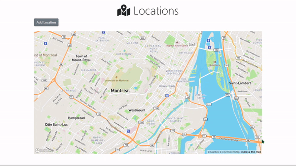

# About
A simple app that allows user to add markers on a map by entering addresses

<p align="center">
  
</p>

# Description
### Purpose
I built this application while learning about GeoJSON. I learnt how to use mapbox and GeoJSON data to show locations and map view in a webpage.

### Language, Frameworks and libraries
- NodeJS
- Express JS
- MongoDB
- Mapbox
- Bootstrap

# How to run
Install dependencies
```sh
$ npm install
$ npm install -d
```

Run the application
```sh
$ npm run start
```